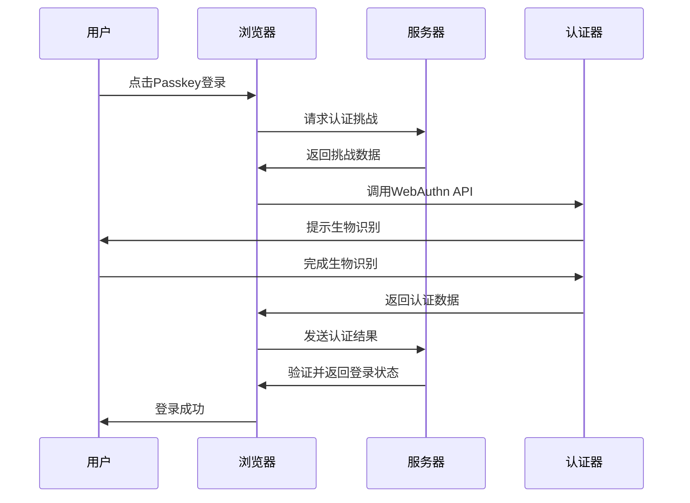

# 🛡️ Passkey 登录功能指南

## ✨ 什么是 Passkey？

Passkey是一种基于WebAuthn标准的现代化无密码认证方式，使用生物识别技术（如指纹、Face ID）或设备PIN码进行身份验证，提供比传统密码更安全、便捷的登录体验。

## 🎯 功能特性

### 🔐 安全优势
- **无密码认证** - 不再需要记忆复杂密码
- **防钓鱼攻击** - 基于公钥加密，无法被窃取或伪造
- **生物识别** - 支持指纹、Face ID、Touch ID等
- **设备绑定** - 认证信息存储在设备本地，无法远程访问

### 💡 用户体验
- **一键登录** - 点击即可完成身份验证
- **跨设备同步** - 支持iCloud钥匙串、Google密码管理器等
- **离线可用** - 不依赖网络连接进行身份验证
- **快速响应** - 认证过程通常在2-3秒内完成

## 🚀 快速开始

### 1. 浏览器支持

Passkey功能需要现代浏览器支持：

| 浏览器 | 最低版本 | 支持状态 |
|--------|----------|----------|
| **Chrome** | 67+ | ✅ 完全支持 |
| **Safari** | 14+ | ✅ 完全支持 |
| **Firefox** | 60+ | ✅ 完全支持 |
| **Edge** | 18+ | ✅ 完全支持 |

### 2. 设备要求

- **Windows 10+** - Windows Hello (指纹、面部识别、PIN)
- **macOS** - Touch ID 或 Touch Bar
- **iOS 14+** - Face ID 或 Touch ID
- **Android 7+** - 指纹识别或设备PIN
- **外部设备** - USB/NFC安全密钥 (YubiKey等)

### 3. 登录步骤

1. **访问登录页面** - 打开NSPass登录页面
2. **点击Passkey按钮** - 点击"使用Passkey登录"紫色按钮
3. **生物识别验证** - 按照设备提示进行指纹或面部识别
4. **自动登录** - 验证成功后自动跳转到主页

## 🛠️ 技术实现

### WebAuthn API

项目使用标准的WebAuthn API实现Passkey功能：

```typescript
// 检查浏览器支持
if (!window.PublicKeyCredential) {
  console.error('浏览器不支持WebAuthn');
  return;
}

// 发起认证请求
const credential = await navigator.credentials.get({
  publicKey: {
    challenge: new Uint8Array(32),
    rpId: window.location.hostname,
    userVerification: 'preferred',
    timeout: 60000
  }
});
```

### 认证流程



## 🔧 配置说明

### 开发环境配置

Passkey功能在开发环境中使用模拟数据：

```typescript
// 模拟挑战生成
const challengeResponse = {
  challenge: btoa(crypto.getRandomValues(new Uint8Array(32))),
  rpId: window.location.hostname,
  allowCredentials: [],
  userVerification: 'preferred'
};

// 模拟验证响应
const mockUser = {
  id: 'passkey-user',
  username: 'passkey-user',
  email: 'passkey@nspass.com',
  role: 'user'
};
```

### 生产环境部署

生产环境需要配置真实的WebAuthn服务：

1. **注册阶段** - 用户首次设置Passkey
2. **认证阶段** - 用户使用Passkey登录
3. **服务器验证** - 验证认证数据的有效性

## 🎨 UI设计

### 按钮样式

Passkey登录按钮采用紫色渐变设计，突出安全性：

```css
.passkey-button {
  background: linear-gradient(135deg, #722ed1 0%, #531dab 100%);
  border-color: #722ed1;
  color: white;
  height: 44px;
  border-radius: 8px;
}
```

### 图标选择

使用Ant Design的`SafetyOutlined`图标，象征安全认证。

## 🚨 错误处理

### 常见错误及解决方案

| 错误类型 | 错误信息 | 解决方案 |
|----------|----------|----------|
| **NotAllowedError** | 认证被拒绝或超时 | 重新尝试认证 |
| **SecurityError** | 安全错误 | 检查域名和HTTPS配置 |
| **NotSupportedError** | 设备不支持 | 使用其他登录方式 |
| **NetworkError** | 网络错误 | 检查网络连接 |

### 错误处理代码

```typescript
try {
  const credential = await navigator.credentials.get(options);
} catch (error) {
  if (error.name === 'NotAllowedError') {
    message.error('Passkey认证被拒绝或超时');
  } else if (error.name === 'SecurityError') {
    message.error('Passkey认证安全错误');
  } else if (error.name === 'NotSupportedError') {
    message.error('此设备不支持Passkey认证');
  }
}
```

## 📱 设备兼容性

### iOS设备
- **iPhone X及以上** - Face ID
- **iPhone 5s - iPhone 8** - Touch ID
- **iPad** - Touch ID (根据型号)

### Android设备
- **指纹识别** - Android 6.0+
- **面部识别** - Android 10+
- **设备PIN** - 所有Android设备

### 桌面设备
- **Windows Hello** - Windows 10/11
- **Touch ID** - MacBook Pro/Air (2016+)
- **USB安全密钥** - 支持FIDO2的设备

## 🔍 调试技巧

### 浏览器控制台

开启浏览器开发者工具，查看WebAuthn相关日志：

```javascript
// 检查Passkey支持
console.log('WebAuthn支持:', !!window.PublicKeyCredential);

// 检查条件式UI支持
PublicKeyCredential.isConditionalMediationAvailable()
  .then(available => console.log('条件式UI支持:', available));
```

### 网络面板

在Network标签中监控以下请求：
- `/api/auth/passkey/challenge` - 获取认证挑战
- `/api/auth/passkey/verify` - 验证认证结果

## 📚 相关资源

### 技术文档
- [WebAuthn规范](https://www.w3.org/TR/webauthn/)
- [FIDO Alliance](https://fidoalliance.org/)
- [MDN WebAuthn指南](https://developer.mozilla.org/docs/Web/API/Web_Authentication_API)

### 工具和库
- [webauthn-json](https://github.com/github/webauthn-json) - 简化WebAuthn使用
- [SimpleWebAuthn](https://simplewebauthn.dev/) - 全栈WebAuthn库
- [Passwordless.dev](https://passwordless.dev/) - WebAuthn服务

## 🎉 总结

Passkey登录功能为NSPass平台带来了：

✅ **更高的安全性** - 基于公钥加密，防止密码泄露  
✅ **更好的用户体验** - 无需记忆密码，一键登录  
✅ **现代化认证** - 符合未来无密码认证趋势  
✅ **跨平台支持** - 适配各种设备和浏览器  

立即体验Passkey登录，享受安全便捷的认证体验！ 🚀 